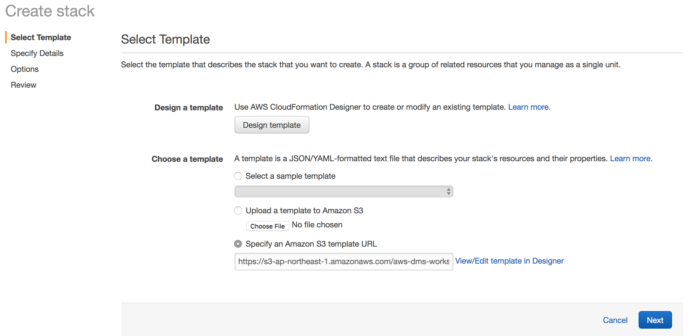
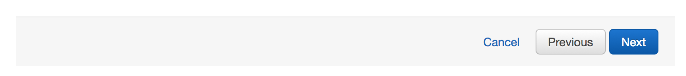
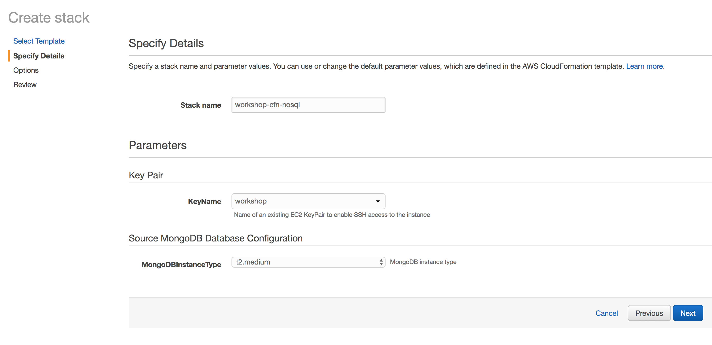
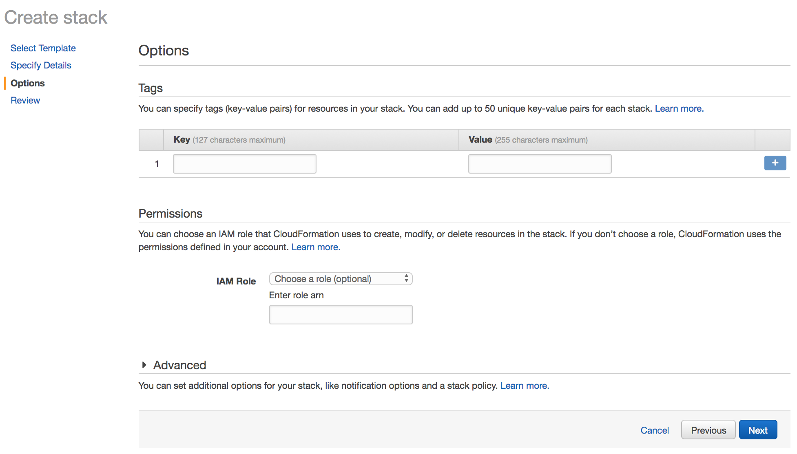
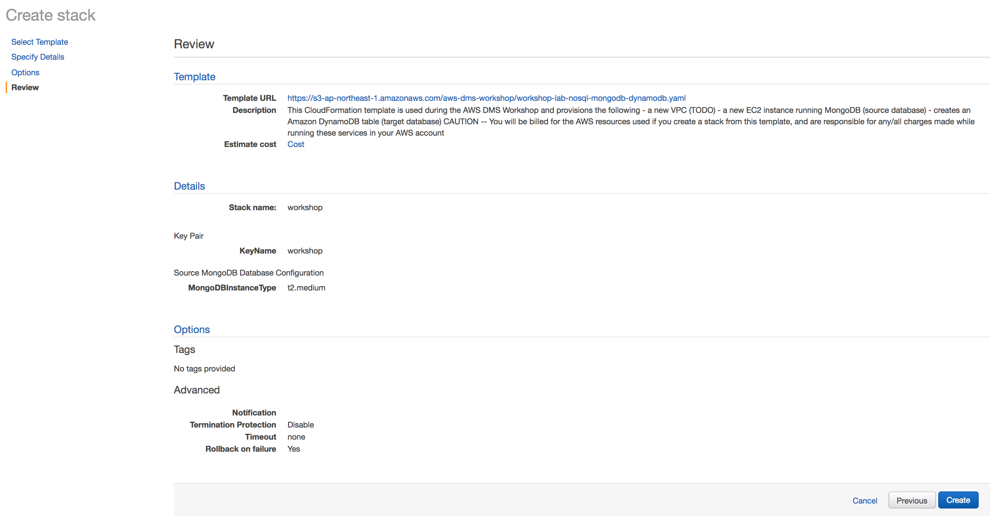
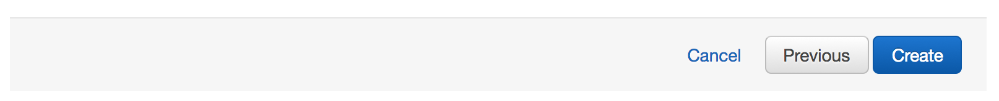
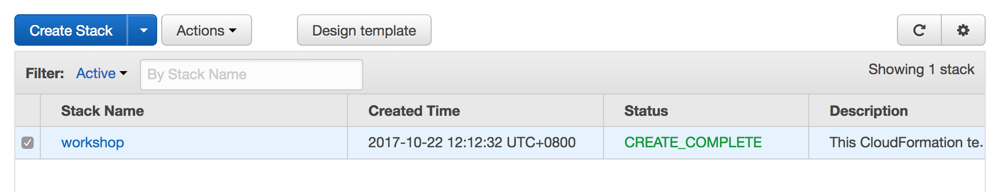

## Setup AWS CloudFormation Stack

In this step, you will launch a AWS CloudFormation template that will setup the following resources needed for this lab:

- Source Database: Amazon RDS Oracle (this database will be pre-populated with sample database installed from <https://github.com/awslabs/aws-database-migration-samples>)
- Target Database: Amazon RDS PostgreSQL

> **CAUTION: The resources created automatically with this CloudFormation template will continue to run until the CloudFormation stack is deleted or the individual resources are shutdown -- the steps for teardown are located in this document at [Teardown: AWS Cloudformation Stack](#teardown-aws-cloudformation-stack)**

To launch this template, use the following link:

> <http://amzn.to/aws-dms-workshop-nosql> (=> <https://ap-northeast-1.console.aws.amazon.com/cloudformation/home?region=ap-northeast-1#/stacks/new?stackName=workshop-cfn-nosql&templateURL=https://s3-ap-northeast-1.amazonaws.com/aws-dms-workshop/workshop-lab-nosql-mongodb-dynamodb.yaml>)

### AWS CloudFormation Stack Selection

You should now see the following:

**The default settings are recommended, and no changes are required to this page.** Click the **Next** button on the bottom of the page to continue.

### AWS CloudFormation Stack Settings

This page displays the settings and parameters for the CloudFormation stack.

- For **KeyPair**, you will need to confirm your Key Pair created earlier (in our example, it is labeled workshop)

Once you have confirmed the settings, click the **Next** button on the bottom of the page to continue.

### AWS CloudFormation Stack Options

You will now see the Options for this CloudFormation template. **The default settings are recommended, and no changes are required to this page.** 

Click the **Next** button on the bottom of the page to continue.

### AWS CloudFormation Stack Review

Click the **Create** button on the bottom of the page to continue.

**AWS resources associated with this workshop lab will now be automatically created immediately, and billing will proceed until this CloudFormation stack is deleted or those resources are individually stopped/terminated -- the steps for teardown are located in this document at [Teardown: AWS Cloudformation Stack](#teardown-aws-cloudformation-stack)**

### AWS CloudFormation Stack: List Stacks

You should now see a list of any existing CloudFormation templates for this region in your account, and the new CloudFormation stack called **workshop** should now appear in your console.

If the stack does not immediately appear, you may need to click the **Refresh** button above the list panel.

### AWS CloudFormation Stack: Outputs

When the stack and its underlying resource creations are completed, the status will be displayed as **CREATE_COMPLETE**. Once this has occurred, we can gather Outputs from the CloudFormation stack.

