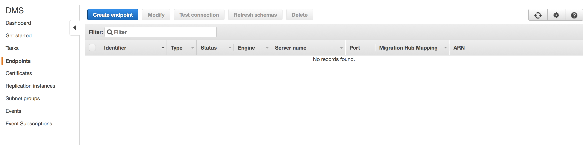
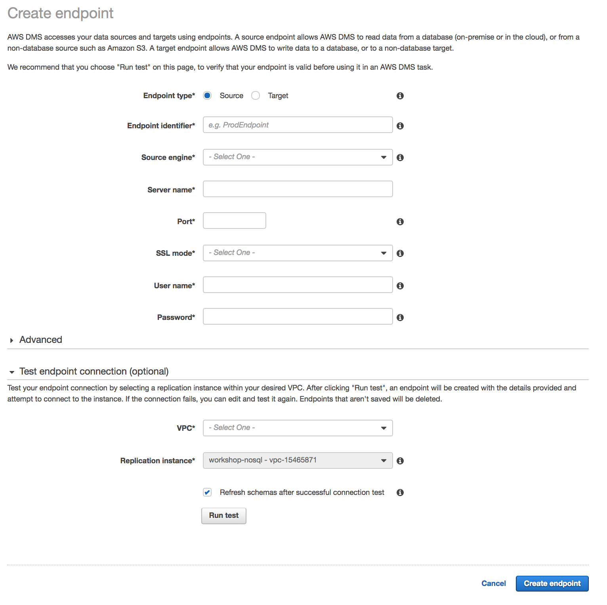
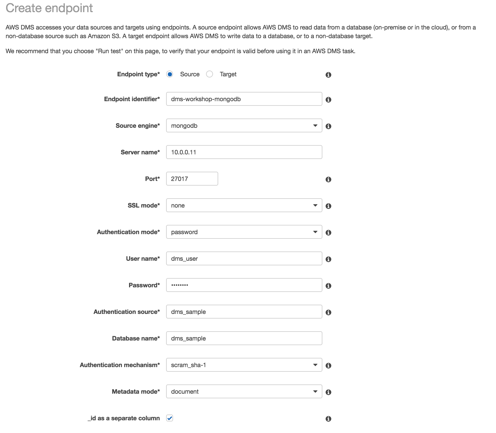
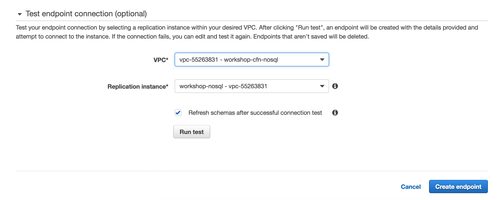
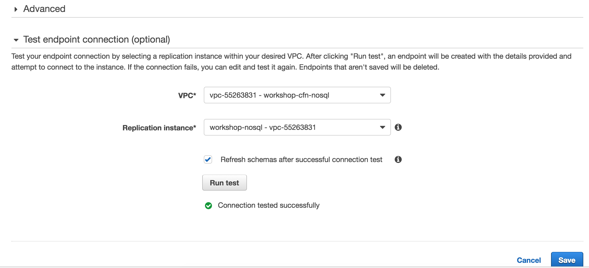
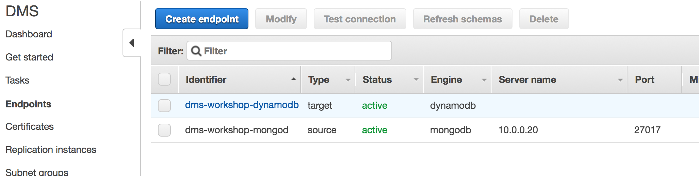
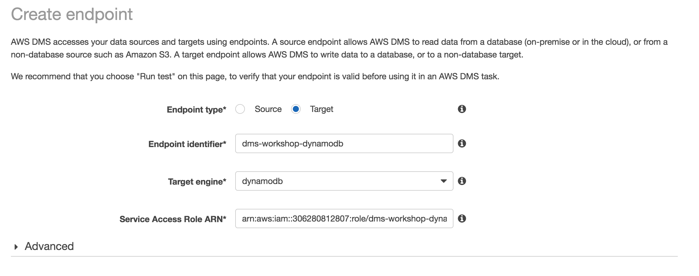
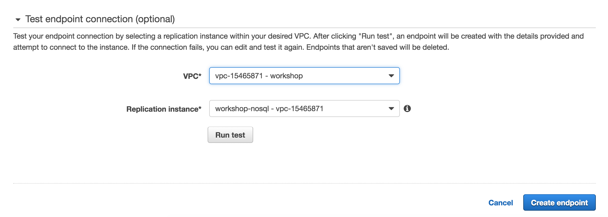
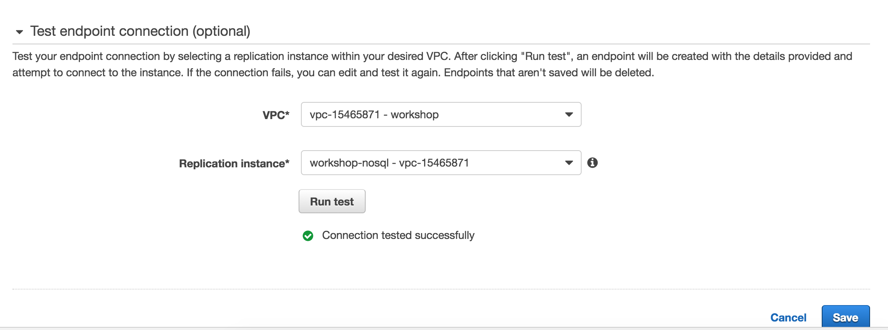

### AWS DMS Endpoints

#### AWS DMS Endpoints - List All

To create our new AWS DMS endpoints, we will first view the console for endpoints by visiting the following link:

> <http://amzn.to/aws-tokyo-dms-endpoints> (=> <https://ap-northeast-1.console.aws.amazon.com/dms/home?region=ap-northeast-1#endpoints:>)

You should now see the following screen:

Click the **Create Endpoint** button to proceed to creating the first endpoint.

#### AWS DMS Endpoints - Create Source

You should now see the following page:

#### DMS Endpoint - Enter Data for Source Endpoint

Enter the fields as follows:

- **Endpoint type**: (select default of Source)
- **Endpoint identifier**: dms-workshop-mongodb
- **Source engine**: mongodb
- **Server name**: (the **MongoDBServerIP** generated by the CloudFormation stack)
- **Port**: 27017
- **SSL mode**: none
- **Authentication mode**: password
- **User name**: dms_user
- **Password**: dms_user
- **Authentication source**: dms_sample
- **Database name**: dms_sample
- **Authentication mechanism**: scram_sha-1
- **Metadata mode**: document
- **_id as a separate column**: (selected/checked)

For the test portion, fill the following details:

- **VPC**: (select the VPC marked with **workshop**)
- **Replication Instance**: (select the DMS Replication Instance created earlier)
- **Refresh schemas...**: (leave default of checked)

#### DMS Endpoint - Test Source Endpoint

Selecting the **workshop** VPC and the **DMS Replication Instance** that lives in that VPC that you created earlier, you can now test the connection from that Replication Instance instance to the Source database via the **DMS Endpoint** settings above. Click the **Run Test** button to proceed. A successful test will display as Connection Successfully Tested as shown below:

You can now click the **Save** button to save this endpoint.

---

Congratulations! You have successfully set up and tested the Source endpoint. We will now repeat the process for the Target endpoint.

---

#### AWS DMS Endpoints - List All (Updated)

We will return to the DMS Endpoints view in the console by visiting the following link:

> <http://amzn.to/aws-tokyo-dms-endpoints> (=> <https://ap-northeast-1.console.aws.amazon.com/dms/home?region=ap-northeast-1#endpoints:>)

You should now see the following screen:

Again, we will click to **Create Endpoint**, seeing the Create Endpoint page as before.

Enter the fields as follows:

- **Endpoint type**: Target
- **Endpoint identifier**: dms-workshop-dynamodb
- **Source engine**: dynamodb
- **Service Access Role ARN**: (this is the Service Role ARN you created earlier)

For the test portion, fill the following details:

- **VPC**: (select the VPC marked with **workshop**)
- **Replication Instance**: (select the DMS Replication Instance created earlier)
- **Refresh schemas...**: (leave default of checked)

#### DMS Endpoint - Test Target Endpoint

Selecting the **workshop** VPC and the **DMS Replication Instance** that lives in that VPC that you created earlier, you can now test the connection from that Replication Instance instance to the Target database via the **DMS Endpoint** settings above. Click the **Run Test** button to proceed. A successful test will display as Connection Successfully Tested as shown below:

You can now click the **Save** button to save this endpoint. You should now see the list of DMS Endpoints with two endpoints in an Active status as shown below:

---

You have now successfully created both DMS Endpoints, Source and Target, and you can now move to the creation of a DMS Task.

---