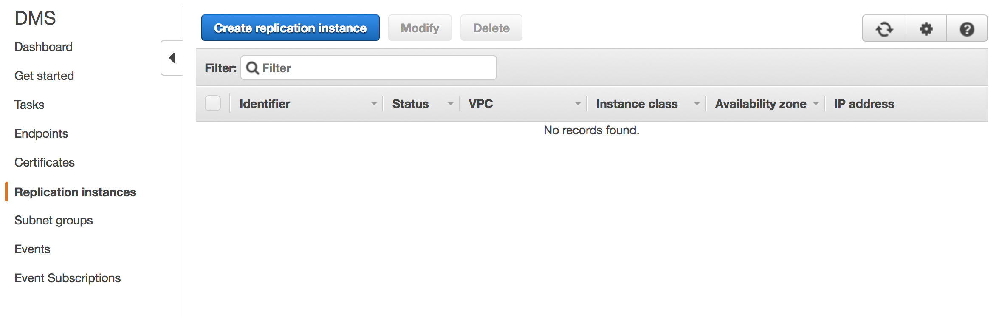
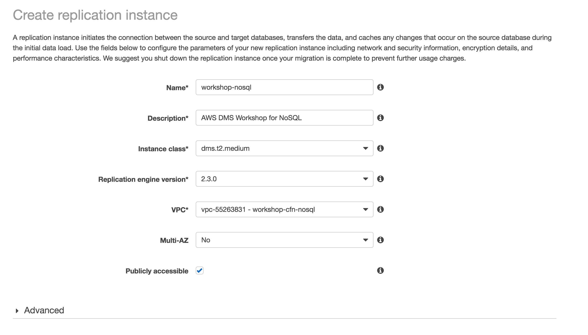
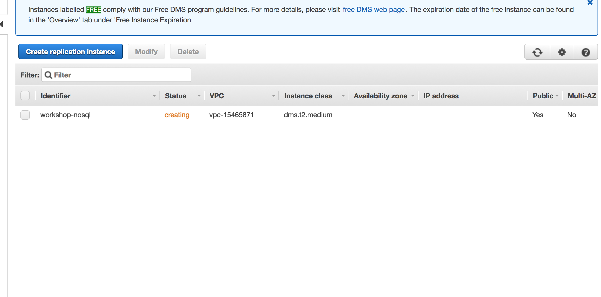
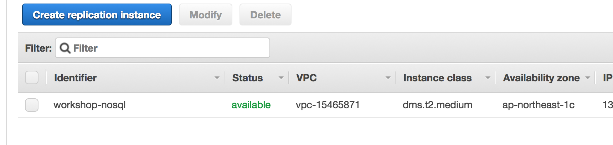

## AWS Database Migration Services

The AWS Database Migration Service (AWS DMS) consist of three main components:

- **Replication Instances** for performing the movement of data
- **Endpoints** for specifying the source and target databases
- **Tasks** for controlling the execution of migrations on the replication instances

We will provide instructions on how to set up each of these three components.

### AWS DMS Replication Instances

#### AWS DMS Replication Instances - List All

To create our new AWS DMS replication instances, we will first view the console for replication instances by visiting the following link:

> <http://amzn.to/aws-tokyo-dms-instances>
(=> <https://ap-northeast-1.console.aws.amazon.com/dms/home?region=ap-northeast-1#replication-instances:>)

You should now see the following screen:

#### AWS DMS Replication Instances - Create New

Next, click on **Create Replication Instance** button, and populate the values on this page:

using the following values:

- **Name**: workshop-nosql 
- **Description**: AWS DMS Workshop for NoSQL
- **Instance class**: dms.t2.medium
- **Replication engine version**: (leave as default)
- **VPC**: (select VPC created by CloudFormation stack, which should be named **workshop**)

> **CAUTION: The replication instance created here will continue to run until specifically deleted -- the steps for teardown are located in this document at [Teardown: AWS DMS Resources](#teardown-aws-dms-resources)**

#### AWS DMS Replication Instances - Confirm

After creation, the replication instance(s) will be provisioned and display status of **Creating**:

...before changing to **Available**:

---

Now that the **DMS Replication Instance** server is ready and available to perform database migrations, we will next create **DMS Endpoints** to connect the Replication Instance to the Source and Target databases.

---