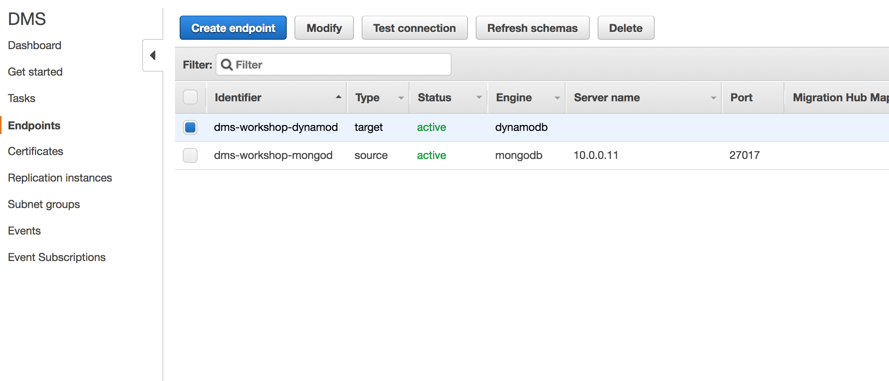
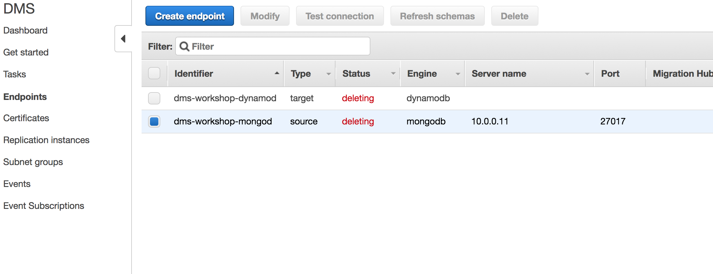

## Teardown AWS DMS Resources

You will now destroy the previously created AWS DMS resources. Because there is an interdependency between these resources, we will terminate the resources in the reverse order of the original creation.

The order for destruction will be:

- Tasks
- Endpoints
- Replication Instances

You can find all of these resources under the AWS console for AWS Database Migration Services at the following link:

> <http://amzn.to/aws-tokyo-dms-instances>
(=> <https://ap-northeast-1.console.aws.amazon.com/dms/home?region=ap-northeast-1#replication-instances:>)

### Teardown AWS DMS Resoures: Tasks

First, you will delete the existing AWS DMS Task associated with this workshop. You can find this at the following link:

> <http://amzn.to/aws-tokyo-dms-tasks>
(=> <https://ap-northeast-1.console.aws.amazon.com/dms/home?region=ap-northeast-1#tasks:>)

You should see a list of all DMS Tasks in this region. Locate the DMS Task created earlier during this workshop. The default name for the Task created during this workshop was **dms-workshop-task-oracle2postgres**.

Select the task and, if it is running, click the **Stop** button.

Wait a few moments until the Task until the status is updated to Stop, then click the **Delete** button.

---

The process of deleting a DMS Task may take a minute or two. Continue to refresh until the DMS Task is no longer visible, then proceed to the next step.

---

### Teardown AWS DMS Resoures: Endpoints

Next, you can now delete the DMS Endpoints that were created earlier in this lab. You can find this at the following link:

> <http://amzn.to/aws-tokyo-dms-endpoints> (=> <https://ap-northeast-1.console.aws.amazon.com/dms/home?region=ap-northeast-1#endpoints:>)

You should now see a list of all DMS Endpoints in this region. There will be two Endpoints to delete, one for the Source and one for the Target. The default names for this workshop are:

- Source: **dms-workshop-mongodb**
- Target: **dms-workshop-dynamodb**

If you used those defaults, your page should look like the following:

**Delete** both Source and Target endpoints, confirming that you wish to delete. Finally, you will see the following page:

---

The process of deleting DMS Endpoints may take a minute or two. Continue to refresh until the DMS Endpoints are no longer visible, then proceed to the next step.

---

### Teardown AWS DMS Resoures: Replication Instances

To delete the DMS replication instances for this workshop, we will first view the console for replication instances by visiting the following link:

> <http://amzn.to/aws-tokyo-dms-instances>
(=> <https://ap-northeast-1.console.aws.amazon.com/dms/home?region=ap-northeast-1#replication-instances:>)

Locate the DMS Replication Instance created earlier during this workshop. The default name for the Replication Instance created during this workshop was **dms-workshop-mongodb2dynamodb-repl**.

You will now select your workshop DMS Replication Instance, clicking the **Delete** button to proceed:

Click the **Delete** button again if you certain this is the correct DMS Replication Instance you set up earlier in the workshop.

The status of the Replication Instance will now show as **Deleted**

---

The process of deleting DMS Replication Instances may take a minute or two. Continue to refresh until the DMS Replication Instances are no longer visible, then proceed to the next step.

---