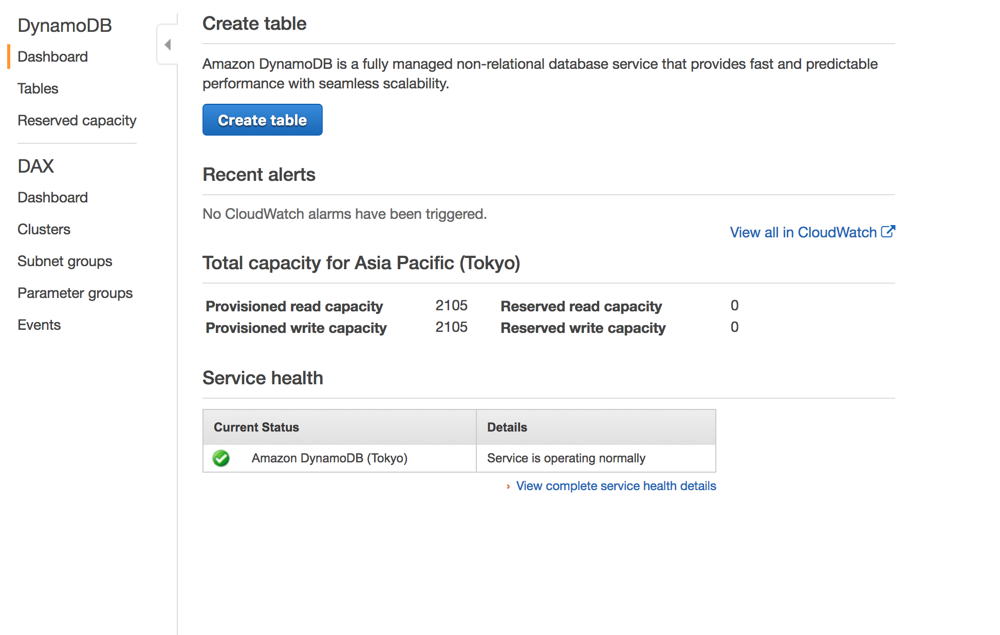
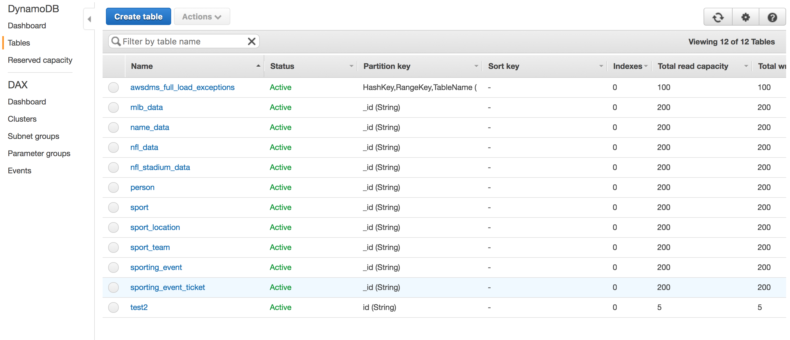
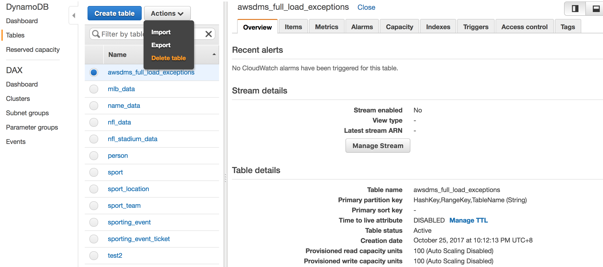
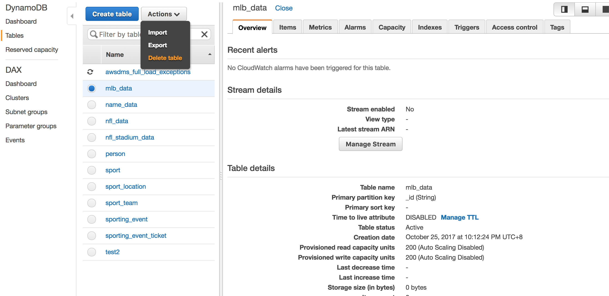
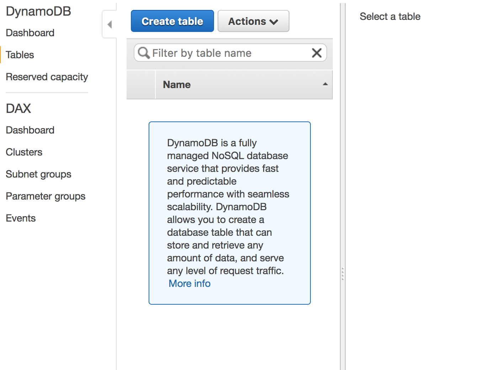

## Teardown DynamoDB

> **CAUTION**: It is critical that you delete your DynamoDB tables to avoid incurring costs -- **the currently provisioned DynamoDB tables will cost approximately USD$1400/month!**

Under Tables, you will see a number of tables that need to be deleted

Select each table and click **Delete table**

Repeat for all tables that were created during the workshop

Until there are no more tables remaining

