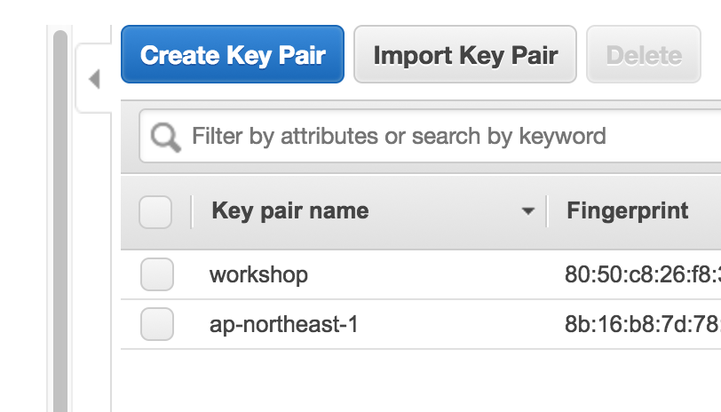
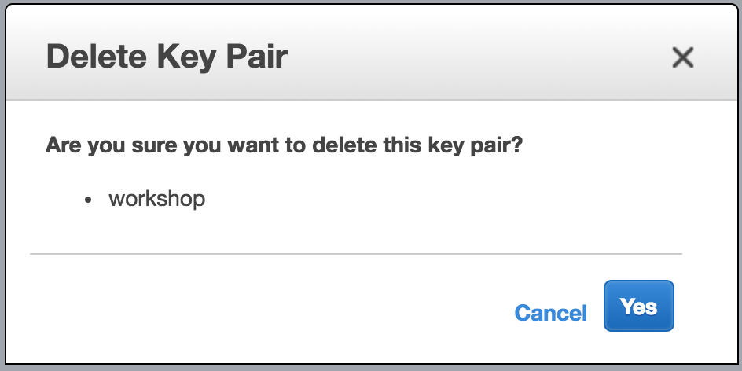

## Teardown EC2 Key Pair

If you had previously created an EC2 key pair for this workshop during [setup](#setup-ec2-key-pair), it is recommended that you now delete it to ensure security.

Follow this link to access your list of EC2 key pairs in this region:

<http://amzn.to/aws-tokyo-keypairs> (=> <https://ap-northeast-1.console.aws.amazon.com/ec2/v2/home?region=ap-northeast-1#KeyPairs:sort=keyName>)

You will see a list of key pairs similar to the following:

Next, select the appropriate key pair (the default name for this workshop key pair was **workshop**), and click the **Delete** button, after which you will receive the following confirmation:

If you are certain this is the workshop key you created, then click **Yes** button to permanently delete this key.

> **CAUTION**: the EC2 Key Pair will be permanently deleted and cannot be recovered, so any associated resources will no longer be administratively accessible.