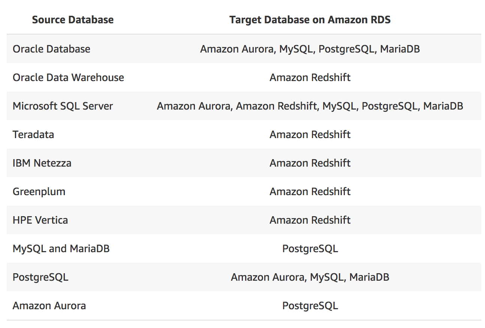

\newpage

## About the AWS Schema Conversion Tool (AWS SCT)

The AWS Schema Conversion Tool makes heterogeneous database migrations predictable by automatically converting the source database schema and a majority of the database code objects, including views, stored procedures, and functions, to a format compatible with the target database. Any objects that cannot be automatically converted are clearly marked so that they can be manually converted to complete the migration. SCT can also scan your application source code for embedded SQL statements and convert them as part of a database schema conversion project. During this process, SCT performs cloud native code optimization by converting legacy Oracle and SQL Server functions to their equivalent AWS service thus helping you modernize the applications at the same time of database migration. Once schema conversion is complete, SCT can help migrate data from a range of data warehouses to Amazon Redshift using built-in data migration agents.

Your source database can be on-premises, or in Amazon RDS or EC2 and the target database can be in either Amazon RDS or EC2. The AWS Schema Conversion Tool supports the following conversions:

