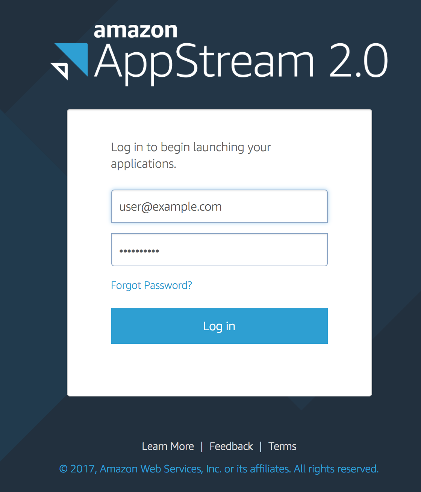
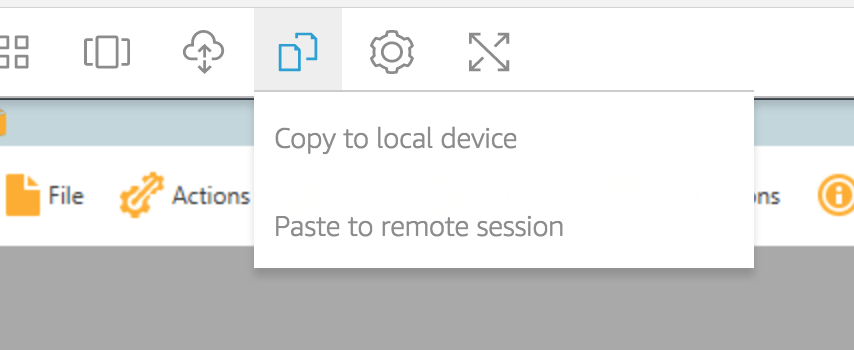
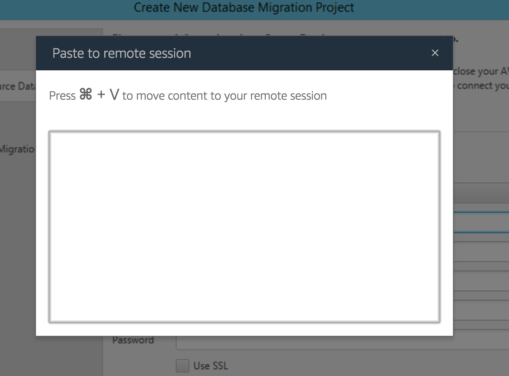

\newpage

## Setup Amazon AppStream Tools

To access the workshop lab tools directly, without any installation, go to the following link:

> <http://amzn.to/aws-dms-workshop-client> (=> <https://appstream2.ap-northeast-1.aws.amazon.com/userpools#/signin?ref=Qxx2JrL9YU>)

You will then see the following login screen:

If you have not already received an email with your credentials, please contact AWS staff on-site during this workshop to help provide those to you.

### Amazon AppStream: Copy & Paste

When copying into your AppStream session, you will need to using the menu bar at the top of the AppStream screen, as show below:

By selecting the **Paste to remote session** option, you will now be presented with a dialog (shown below is the Mac OS X version):

Following the instructions (using either {Command-V} in Mac, or {Control-V} on Windows), the dialog will automatically disappear and the buffer for pasting will now be transferred to the remote desktop, where it can be pasted using the standard Windows paste keys of {Control-V}.
