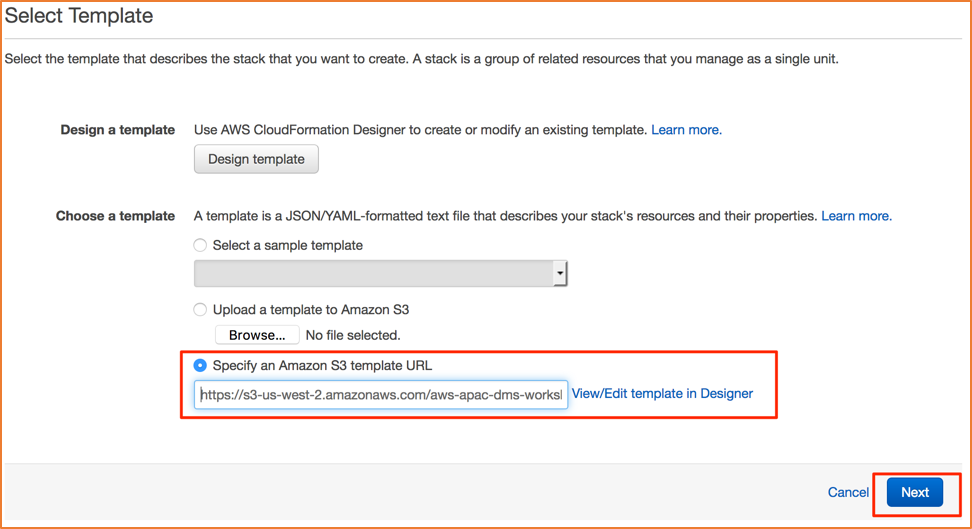

\newpage

## Setup: AWS CloudFormation Stack

In this step, you will launch a AWS CloudFormation template that will setup the following resources needed for this lab:

- Source Database: Amazon RDS Oracle (this database will be pre-populated with sample database installed from <https://github.com/awslabs/aws-database-migration-samples>)
- Target Database: Amazon RDS PostgreSQL

> **CAUTION: The resources that you will be spinning up will continue to run until the CloudFormation stack is deleted or the individual resources are shutdown -- the steps for teardown are located [Teardown: AWS Cloudformation Stack](#teardown-aws-cloudformation-stack)

To launch this template, use the following link:
<http://bit.ly/aws-dms-workshop-lab-1>

You should see the following:

Clicking the **Next** button should display the following screen, with fields prepopulated as shown below:
