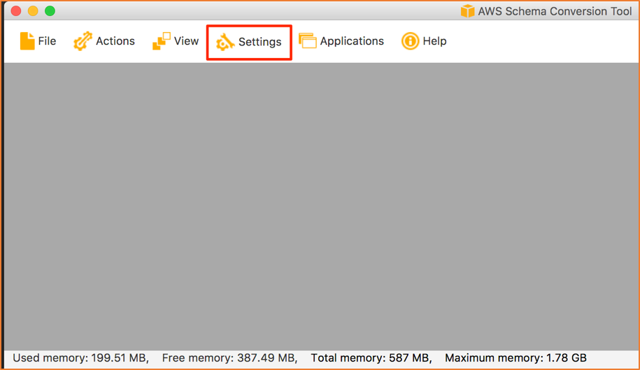
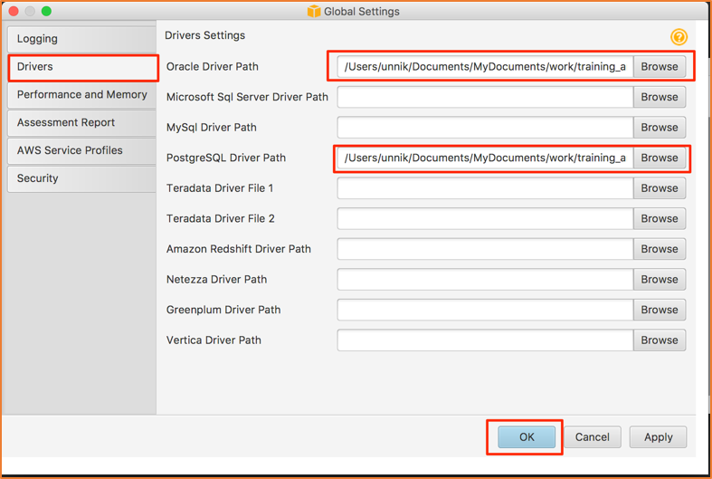

## (Optional) Setup AWS Schema Conversion Tool

In this step, you will install the AWS Schema Conversion Tool locally.

> *For those participants not wishing to install the AWS Schema Conversion Tool locally, you can use the Schema Conversion Tool via Amazon AppStream 2.0 resources that will have been temporarily provisioned for your use during this lab. See [Setup: Accessing Amazon AppStream 2.0 Tools](#setup-amazon-appstream-tools)*

### AWS SCT Download

Download the latest version of AWS Schema Conversion Tool (SCT) from the following link:

> <http://amzn.to/aws-sct> (=> <http://docs.aws.amazon.com/SchemaConversionTool/latest/userguide/CHAP_SchemaConversionTool.Installing.html>)

> *If you already have SCT installed, we recommend that you download and install the latest version*

### Download JDBC Drivers

For connecting to your source database (Oracle) and target database (PostgreSQL), you will need the appropriate JDBC drivers for both databases. If you have not already done so, download the [JDBC Drivers](#setup-jdbc-drivers) before moving forward.

### Configure AWS SCT with JDBC Drivers

Once downloaded, launch AWS Schema Conversion Tool. On first launch, you will be presented with a terms and conditions statement, click **Agree** if you agree to the terms and conditions specified.

Next, you should see the following page:

Click on **Settings** > **Global Settings**

Now you should see the following Global Settings dialog:

Make the following changes to the Global Settings:

- Select **Drivers** on the left-side panel
- For the **Oracle Driver Path**, select the location of your local Oracle jar file
- For the **PostgreSQL Driver Path**, select the location of your local PostgresSQL jar file
- Click **OK** to Proceed
