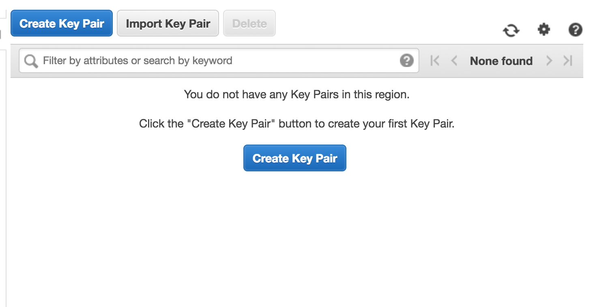
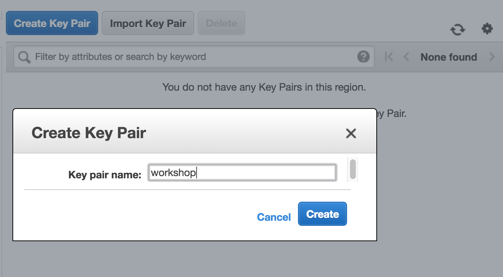
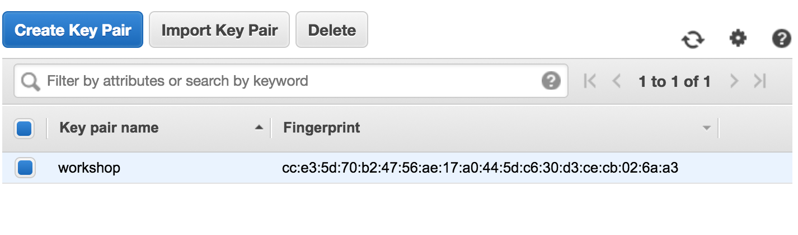

\newpage

## Setup: EC2 Key Pair

In this step, you will generate an EC2 key pair for use in the Database Migration Workshop labs.

Make sure you are have selected the **Asia Pacific (Tokyo)** region by visiting the following link:

> http://bit.ly/ap-northeast-1-keypairs

If no EC2 key pairs have been created in this region yet, you will see the following screen:

> *For this workshop, we recommend the creation of a new EC2 key pair to be used associated with workshop resources. We will later delete this key pair along with the workshop resources.*

You should click the **Create Key Pair** button and enter **workshop** as the name for the new key pair as shown below, clicking the **Create** button to complete the creation of the new key pair.

You should now see a new EC2 key pair labeled **workshop**:

The private key for this EC2 key pair will have automatically downloaded to your browser's default directory, and this file will be called **workshop.pem**.