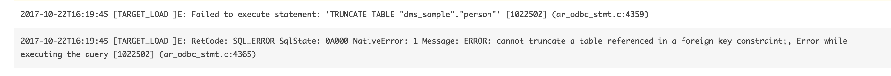
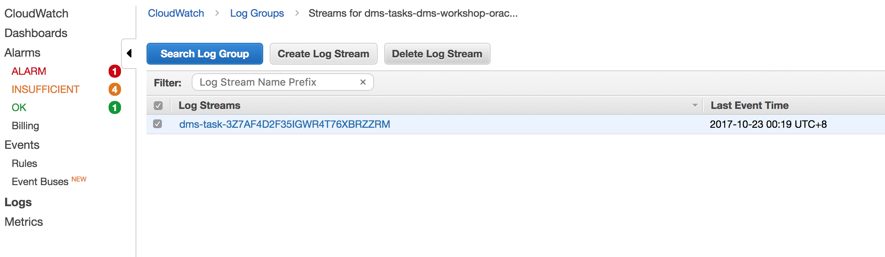
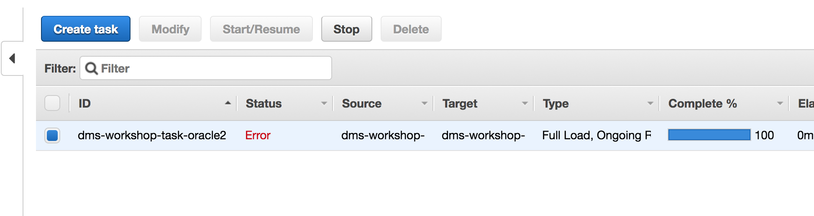
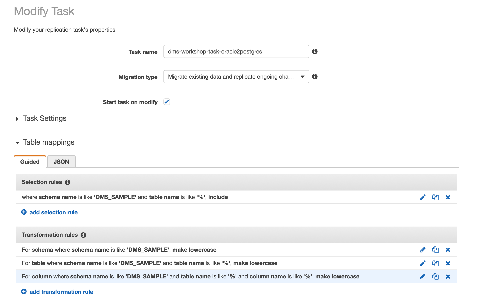
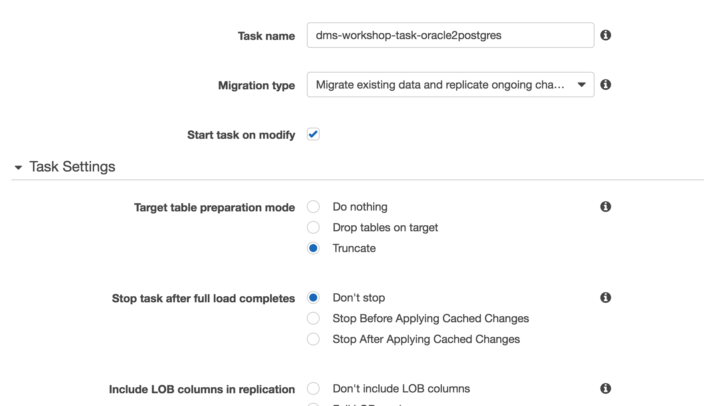
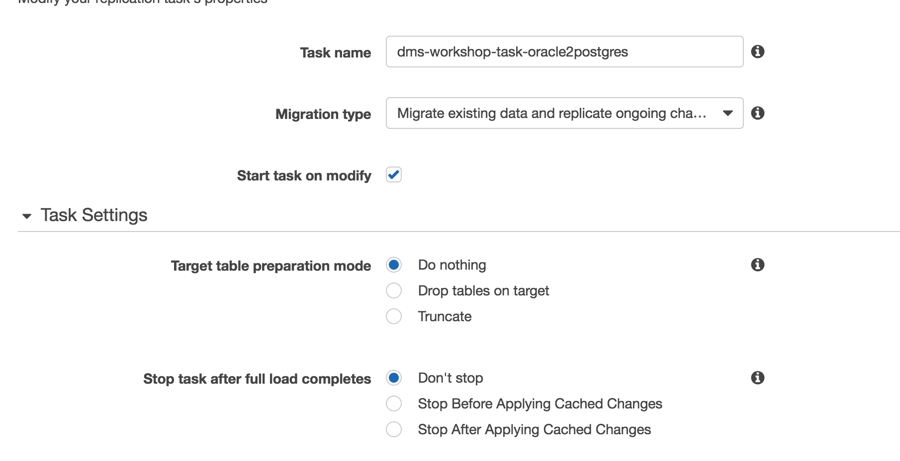
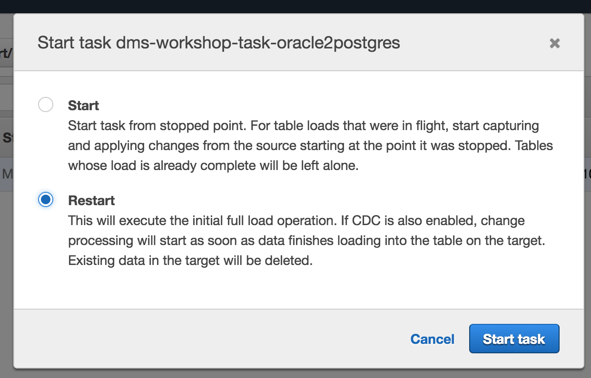
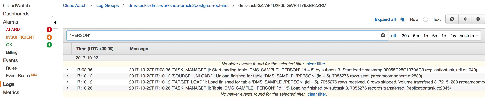

## AWS DMS Errors

The following are common errors and fixes

### Error: “CANNOT TRUNCATE A TABLE REFERENCED IN A FOREIGN KEY CONSTRAINT”

#### Why am I seeing this error

The initial load in DMS is done table by table which means that the target tables cannot have active foreign key constraints. As we are using SCT to convert Oracle source objects into PostgreSQL target objects, all secondary objects were created as part of the process. This means that we would need to disable all foreign key constraints on the target for the initial full load to be successful. Foreign keys or referential integrity constraints in PostgreSQL are implemented using triggers. One way to disable foreign keys is to disable all triggers temporarily from the instance and do the loads.

One of the ways to do this is to use the session_replication_role parameter in PostgreSQL. Triggers also have a state in PostgreSQL (Origin, replica, always or disabled). When the session_replication_role parameter is set to replica, only triggers of the state replica will be active and are fired when called. If not, the triggers remain inactive. We have already setup the parameter group on the target to set this role to replica which means all foreign key constraints (innately triggers in the origin state) will not be active. However, PostgreSQL has a failsafe mechanism of not letting a table truncate even with this role set. As we are using prepopulated tables on the target and cannot truncate the table, we need to use do_nothing for the target table prep mode. 

More details available in this blog post: <http://blog.endpoint.com/2015/01/postgres-sessionreplication-role.html>

#### How do I solve this

Delete the CloudWatch Log stream for **dms-workshop-task** – this will give you a clean environment, you can get there through the following link:

<http://amzn.to/aws-dms-workshop-log-streams> (=> <https://ap-northeast-1.console.aws.amazon.com/cloudwatch/home?region=ap-northeast-1#logStream:group=dms-tasks-dms-workshop-instance;streamFilter=typeLogStreamPrefix>)

Select the CloudWatch Log Stream, then click the **Delete Log Stream** button:

Now, return to the **DMS Tasks** page at the following link:

http://amzn.to/aws-tokyo-dms-tasks
(=> <https://ap-northeast-1.console.aws.amazon.com/dms/home?region=ap-northeast-1#tasks:>)

Select the **DMS Task** experiencing errors, and click **Stop** button:

... then, click the **Modify** button, which presents the following page:

Expand the Task Setting, as shown below:

and change **Target table preparation mode** to *Do Nothing* as it is shown below:

Save your changes to the Task by clicking **Modify**, then select **Restart** in the following page as shown below.

The Task will try to perform an initial load from the beginning, so you should wait a few minutes for the load to complete. 

You can check the migration progress for each table. For example, let’s check status for ‘PERSON’ table:

- Go to CloudWatch Logs for the **dms-workshop-task** and search for "PERSON" (including double quotes)
- You can see 3 set of messages for each table:
    - Scan and unloading of records by DMS from Oracle
    - Records being loaded to Postgres
    - Confirmation of records loaded into Postgres

---

You have successfully fixed the truncation issue and now data is being loaded from Oracle to Postgres, but you still see errors in the logs. You will look at another common error next related to supplemental logging.

---