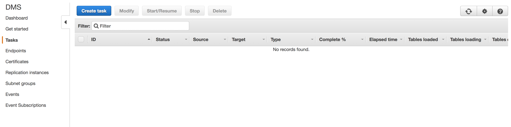
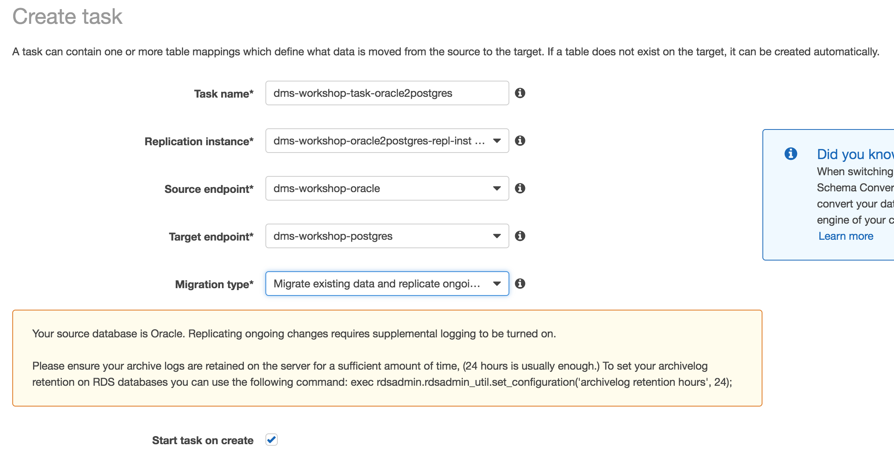
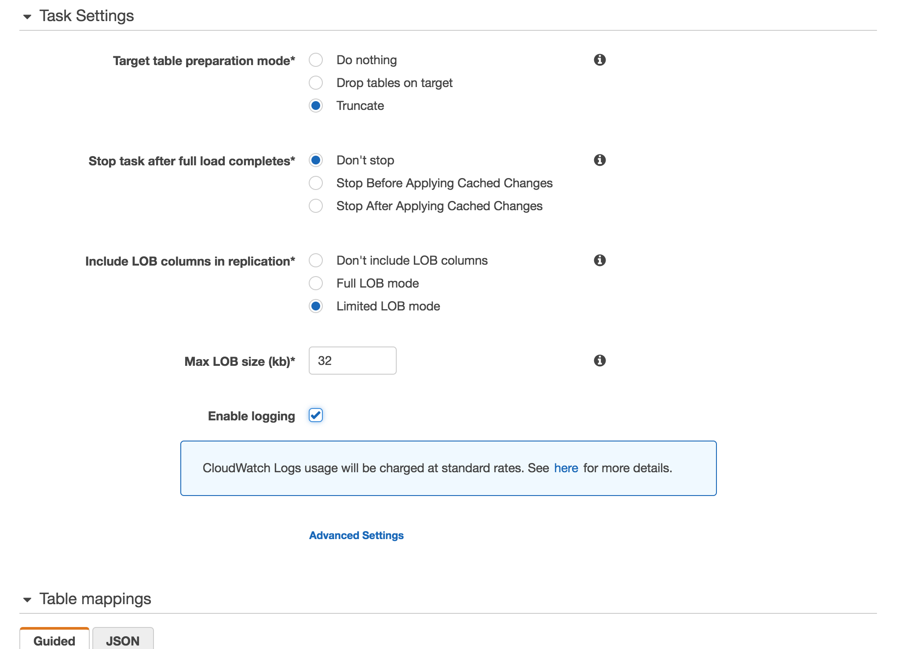
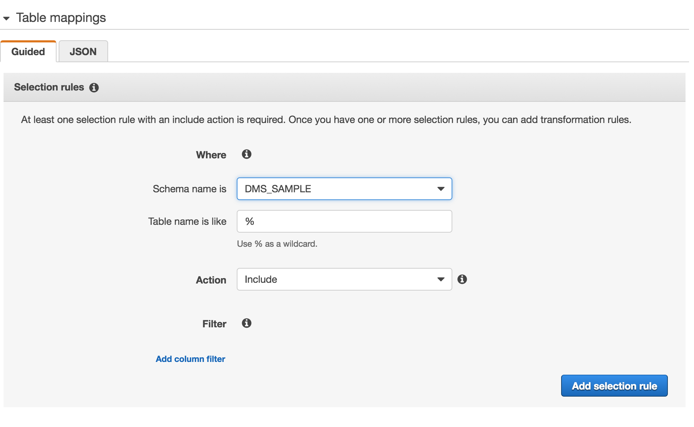
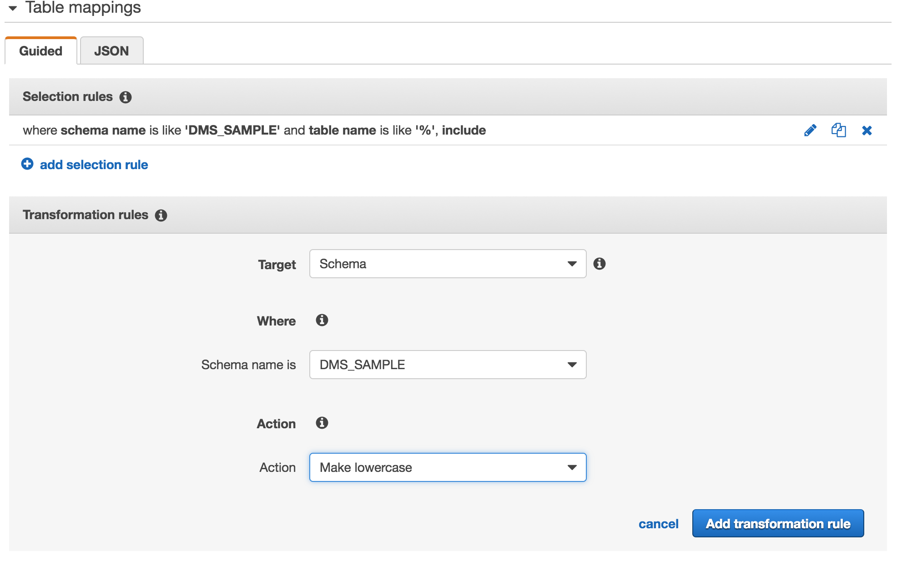
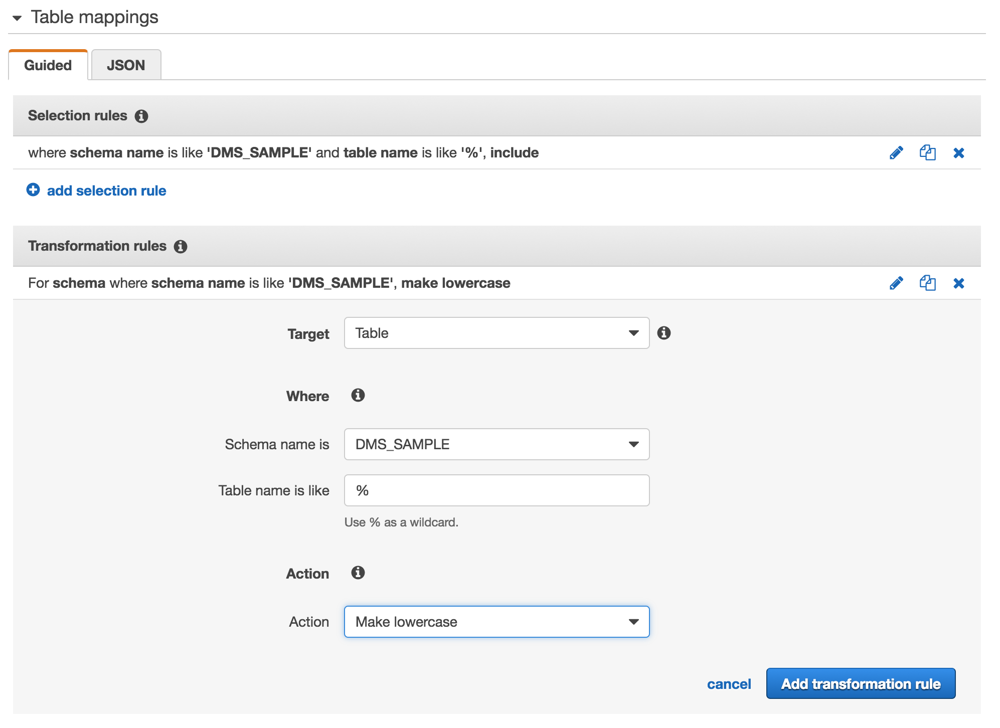
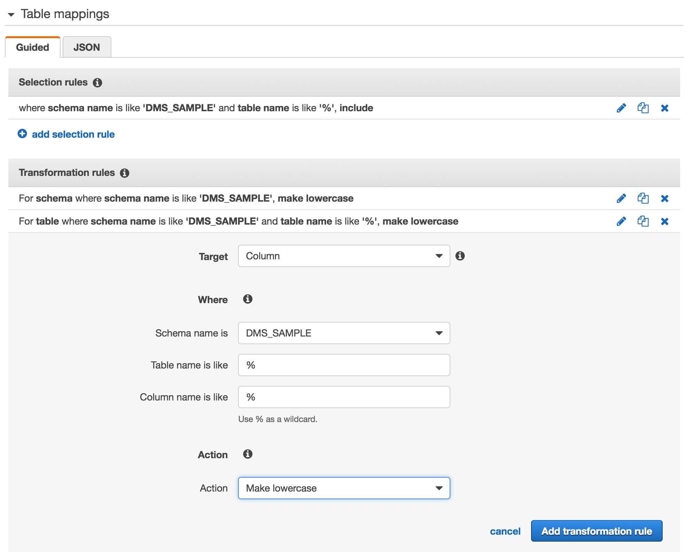
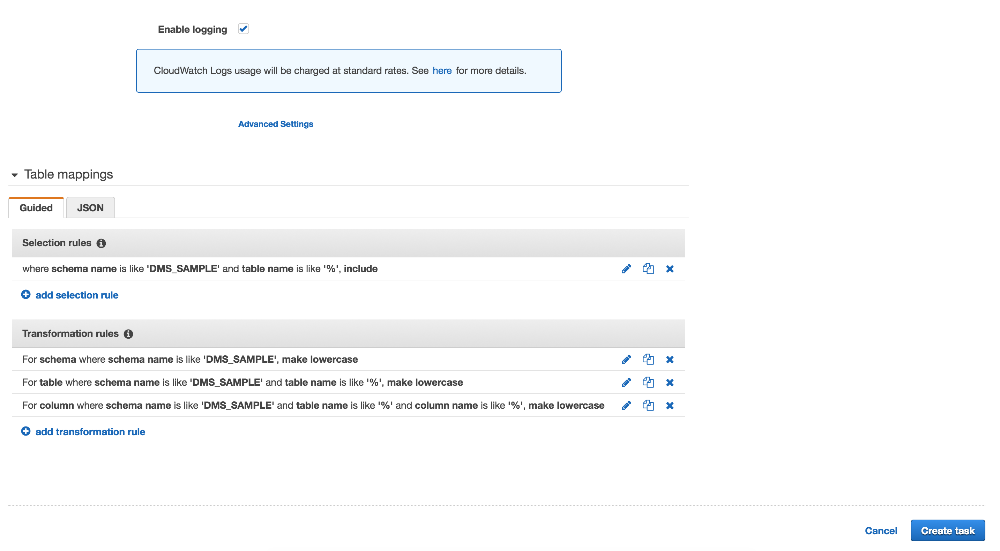
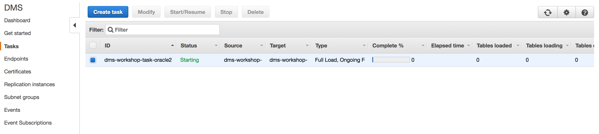

### AWS DMS Tasks

The following link will display all **DMS Tasks** in this region

http://amzn.to/aws-tokyo-dms-tasks
(=> <https://ap-northeast-1.console.aws.amazon.com/dms/home?region=ap-northeast-1#tasks:>)

#### AWS DMS Tasks -- List All

You should now see the following:

#### AWS DMS Tasks - Create New

Enter the following data:

- **Task name**: dms-workshop-task-oracle2postgres
- **Replication instance**: (defaults to **DMS Replication Instance** you created earlier)
- **Source endpoint**: (defaults to **DMS Endpoint** for the Oracle source database that you created earlier)
- **Target endpoint**: (defaults to **DMS Endpoint** for the Postgres source database that you created earlier)
- **Migration type**: Migrate existing data and replicate ongoing changes
- **Start task on create**: (leave this checked)

Enter the following data:

- **Target table preparation mode**: Truncate
- **Stop task after full load completes**: Don't stop
- **Include LOB columns in replication**: Limited LOB mode
- **Max LOB size (kb)**: 32
- **Enable logging**: selected/checked

#### AWS DMS Tasks - Add Selections

#### AWS DMS Tasks - Add Transformations

#### AWS DMS Tasks - Create Task (Final)

Review the information and click the **Create Task** button to continue.

You will now see the new DMS Task listed with a status of Creating, then Starting, then Running, as shown below

---

You have now successfully set up all the major components for a database migration with AWS DMS. Next, we will troubleshoot some errors that commonly occur during real-world migrations.

---