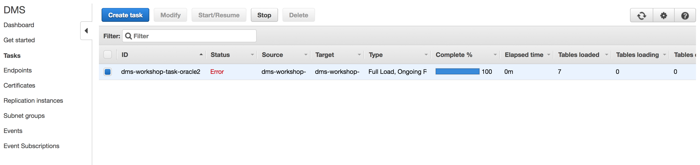
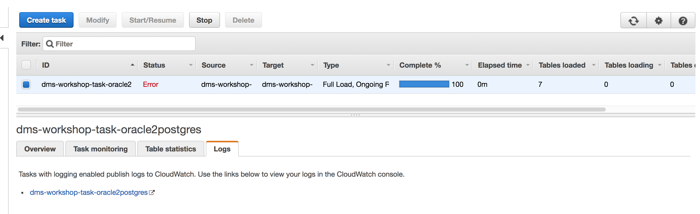
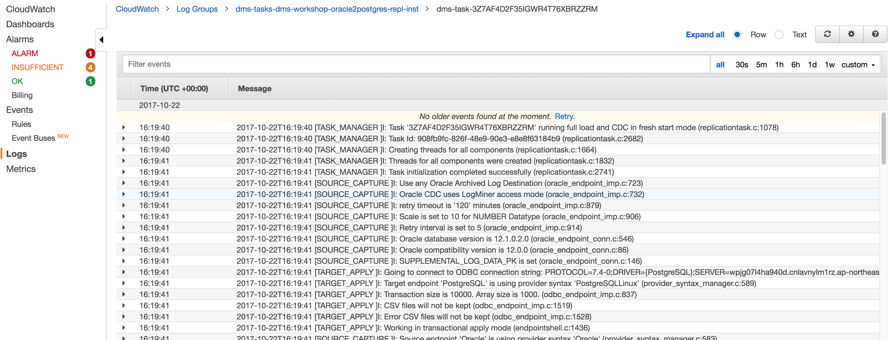
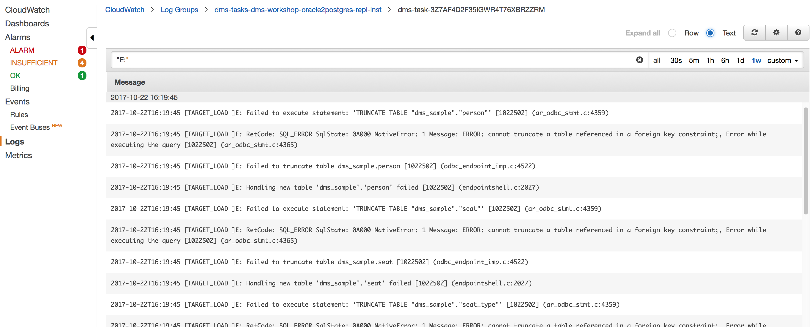

## AWS DMS Troubleshooting

### AWS DMS Troubleshooting - List Tasks (Errors)

After you have created your **DMS Task** and some time has passed, you can revisit the list of DMS Tasks using the following link:

http://amzn.to/aws-tokyo-dms-tasks
(=> <https://ap-northeast-1.console.aws.amazon.com/dms/home?region=ap-northeast-1#tasks:>)

You should see the following:

### AWS DMS Troubleshooting - View Logs

AWS DMS Logs are kept as CloudWatch Logs -- clicking the Log tab for the DMS Task will display a link to the CloudWatch Log as shown below:

You will then see the following:

The complete logging data is significant, so we will filter the CloudWatch logs by:

- Filter all logs for the previous seven days using the ‘1w’ option in the upper-right of the screen
- Change display option (also in upper-right) to display all log entries as **Text** (this can help with readability as an option to the default of **Rows**)
- Filter using the text string of **"E:"** (including the double quotes), which will limit the display to messages with the log level of Error

Once changed, the page should look as follows:

---

We will address these errors one by one

---