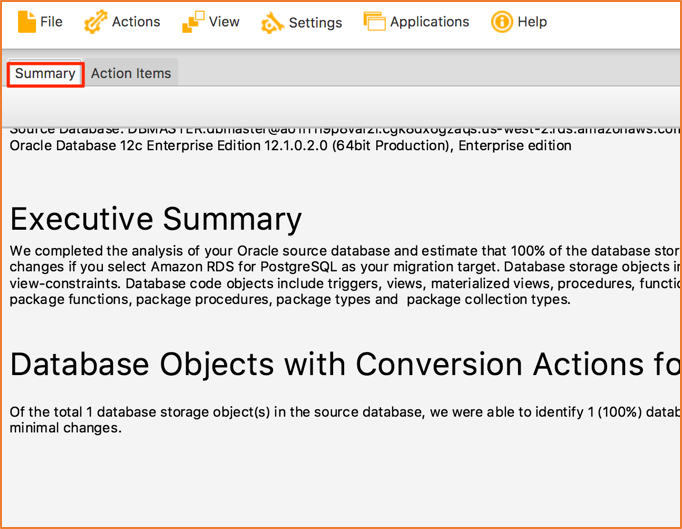
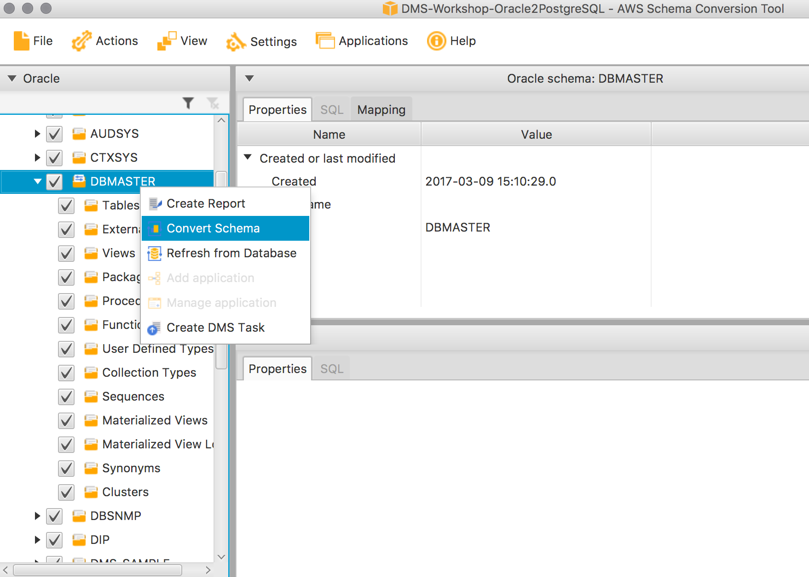
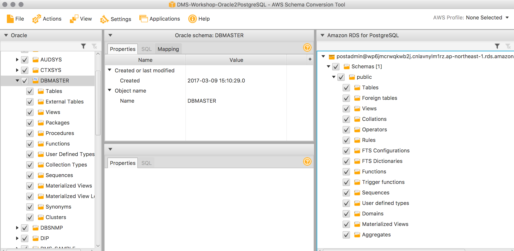
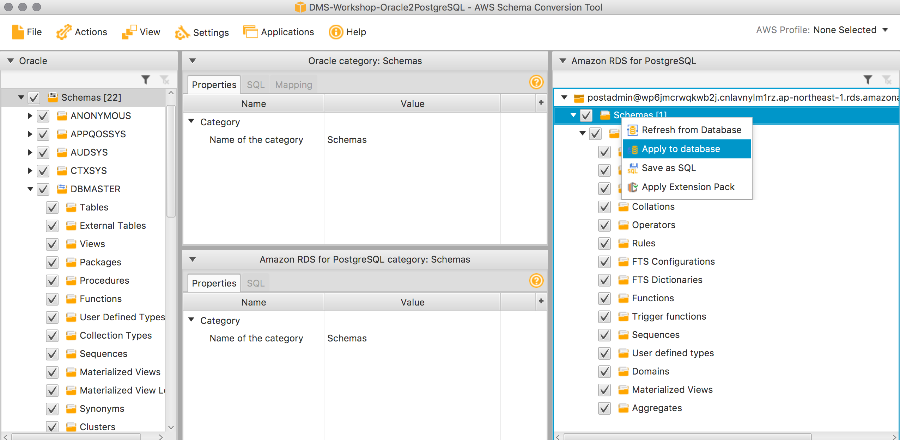

## Convert Schema in AWS SCT

Review the project screen:

- Uncheck all schemas on the left except for the DMS_SAMPLE schema. 
- Click **Actions** > **Create Report**
- Go to the **Summary** tab on the top and review the generated report

### Review and Convert Schema

On the left-hand pane, look through the schema tree of Oracle objects and note what could be automatically converted and what could not be converted.

Now, right click and click *Convert Schema* as shown below:

The schema will be converted and shown on the PostgreSQL instance (it has not been applied yet) as shown below:

Take a few minutes to review the objects being converted.

Since the majority of the objects which could not be converted are secondary objects like functions or procedures, we will proceed with the migration. Right click on the created schema on the right-hand panel, representing the target Postgres database, and click **Apply to database**, as shown below:

This will apply all those converted objects in the PostgreSQL target.

> The above steps will convert all your Oracle objects into PostgreSQL objects. Objects which could not be converted automatically must be taken care of manually after migration at a later time.