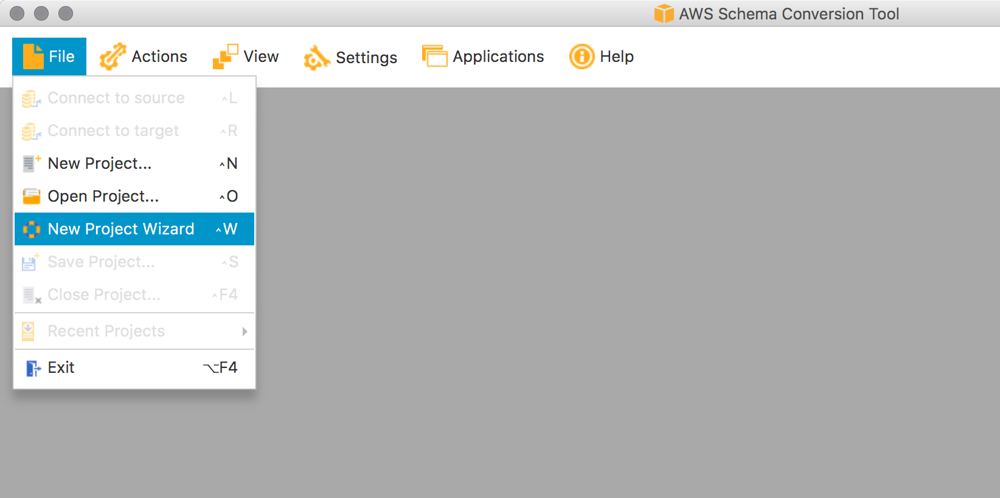

## Create an AWS SCT Project

In AWS SCT, select **File** > **New Project Wizard**

### New Project Wizard – Select Source

Enter the following in the dialog displayed:

- **Project Name** | DMS-Workshop-Oracle2PostgreSQL|
- **Location**: (leave default)
- For **Source Database Engine**, specify:
    - Transactional Database (OLTP) 
    - Oracle
    - I want to switch engine and optimize for the cloud

Click **Next** to continue

### New Project Wizard – Connect to Source Database

Enter the following in the next dialog displayed:

- **Type**:	SID
- **Server Name**: (enter DNS name of your Oracle instance)
- **Server Port**: 1521
- **Oracle SID**: (enter database name, default is Oracle)
- **User name**: dbmaster
- **Password**: (enter the password for your Oracle instance)
- **Oracle Driver Path**: (see notes below)
    - Local: when running AWS SCT locally, then the JDBC jar file for Oracle must be selected from where it was downloaded to earlier
    - DMS Workshop AppStream 2.0 Clients: the path is **C:\\Drivers** as shown below: 
    - 

When finished, click **Test Connection**. If you receive a **Connection Successful** message, then proceed, otherwise reconfirm the values you have entered earlier and try again.

### New Project Wizard - Select Schema

From the Select Schema step, select **DBMASTER** as the Source Schema

### New Project Wizard - Run Database Migration Assessment

### New Project Wizard - Select Target

### New Project Wizard - Test Target Connection

