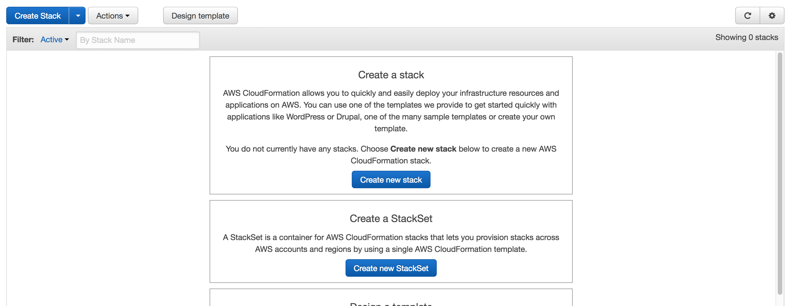
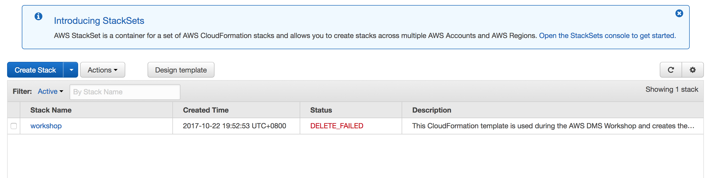
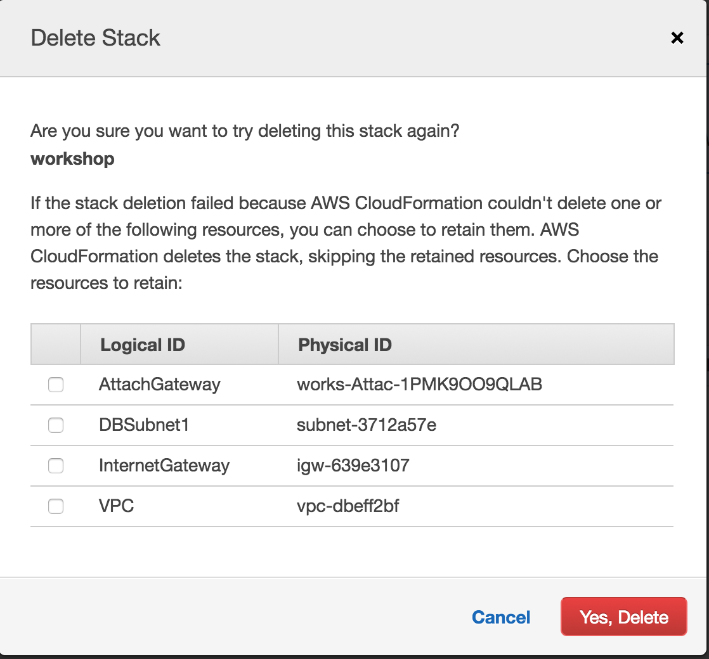

## Teardown AWS CloudFormation Stack

For process of tearing down any resources created by a CloudFormation stack is a part of the CloudFormation lifecycle and can be performed.

> **CAUTION**: This step must be performed after the teardown of any DMS resources -- see [Teardown AWS DMS Resources](#teardown-aws-dms-resources) for this process.

### Teardown CloudFormation Stack: Identify Workshop Stack

You can see a list of all active CloudFormation Stacks in this region by clicking the following link:

<http://amzn.to/aws-tokyo-cloudformation-stacks-active> (=> <https://ap-northeast-1.console.aws.amazon.com/cloudformation/home?region=ap-northeast-1#/stacks?filter=active>)

If you have chosen the default CloudFormation stack name during the setup, then you should now select the checkbox on that specific CloudFormation stack and click the button **Delete Stack**

### Teardown CloudFormation Stack: Delete Workshop Stack

### Teardown CloudFormation Stack: Confirm Deletion

> *If your stack is still displayed with a **Delete in Progress** status, then please wait a few minutes for the CloudFormation stack to complete deletion.*

If the CloudFormation stack has been successfully deleted, and no other stacks are active in this region, you should expect to see the following:

If the CloudFormation stack still exists, check the following remediations below based on the specific CloudFormation Stack Error:

- [Status: Delete Failed](#teardown-cloudformation-stack-status-delete-failed)

### Teardown CloudFormation Stack Status: Delete Failed

If you should see the following message:

First, confirm that the AWS DMS resources have been terminated -- see [Teardown AWS DMS Resources](#teardown-aws-dms-resources) for more details.

Second, you can retry the process to [Delete the Workshop Stack](#teardown-cloudformation-stack-delete-workshop-stack) above. You may be presented with a dialog similar to the following:

If so, then individually confirm that the resources are no longer required, checking the box of each resource you wish to delete, then clicking the **Yes, Delete** button to complete the process.