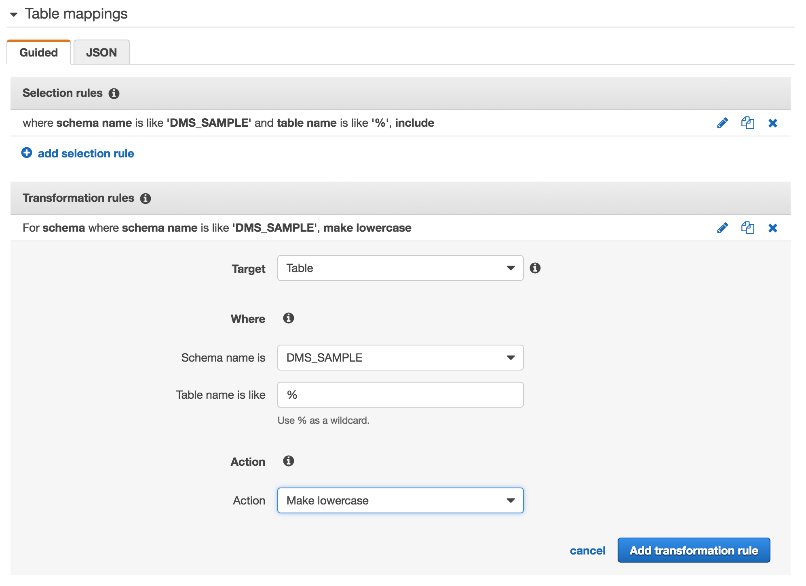
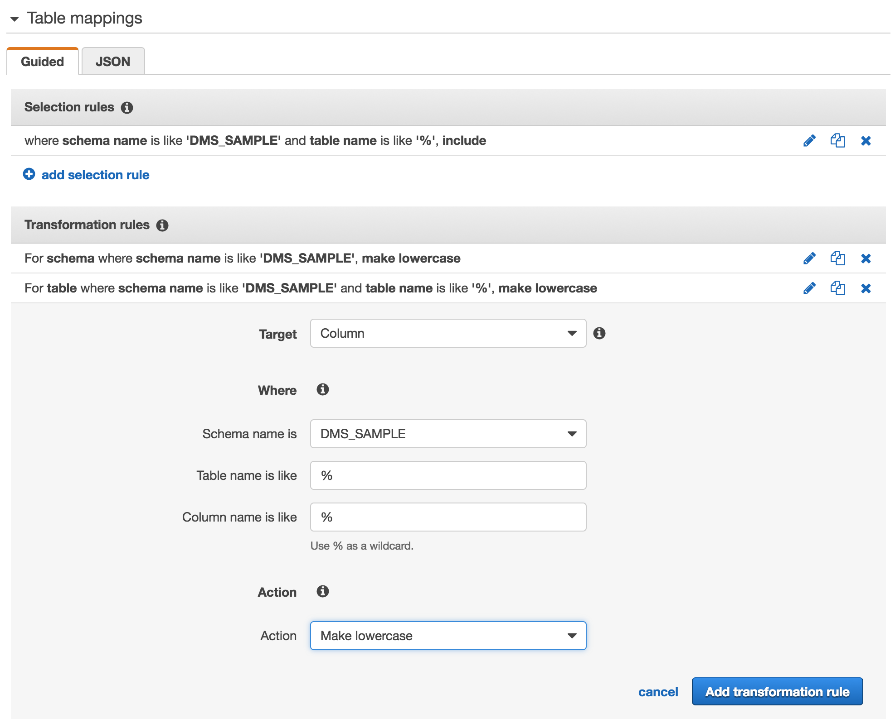
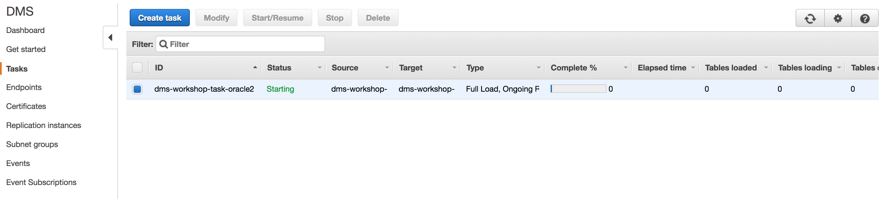

## Teardown AWS DMS Resources

TODO: complete this

#### AWS DMS Tasks - Add Selection Criteria

\newpage

#### AWS DMS Tasks - Add First Transformation

\newpage

#### AWS DMS Tasks - Add Second Transformation

\newpage

#### AWS DMS Tasks - Add Third Transformation

\newpage

#### AWS DMS Tasks - Create Task (Final)

Review the information and click the **Create Task** button to continue.

You will now see the new DMS Task listed with a status of Creating, then Starting, then Running, as shown below

